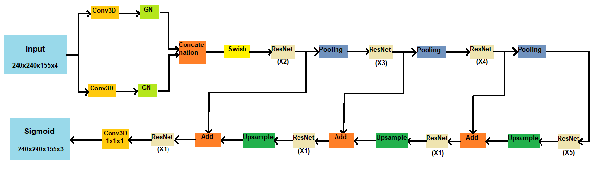
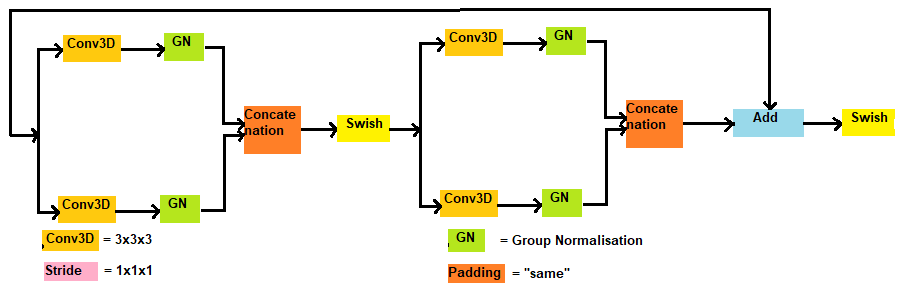
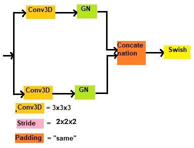
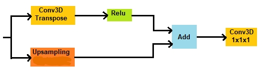
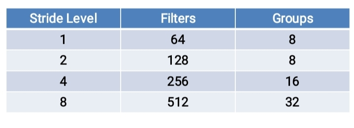
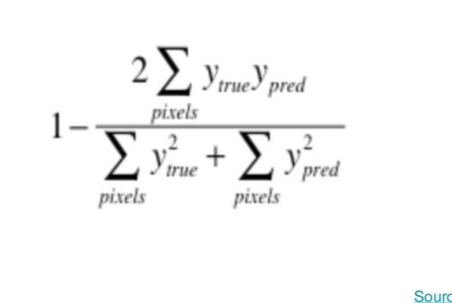
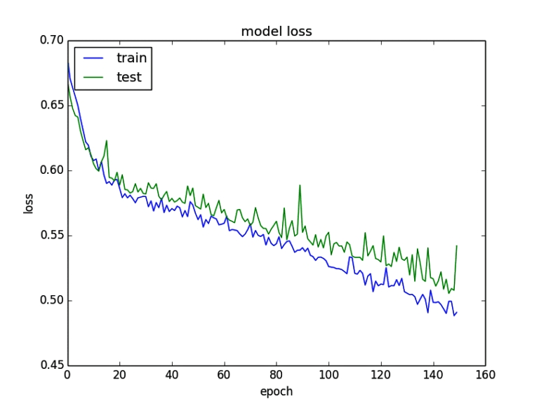
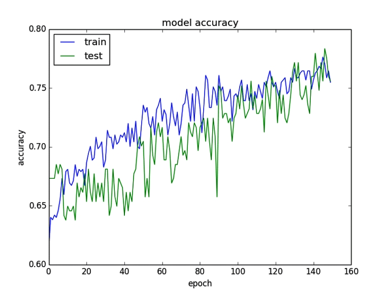
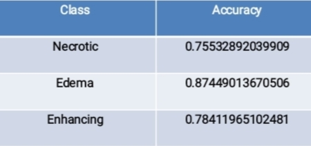

# Abstract
Accurate estimation of the relative volume of the subcomponents of a braintumour is critical for monitoring progression, radiotherapy planning, outcomeassessment and follow-up studies. For this, accurate delineation of the tumour isrequired. Manual segmentation and 2 Dimensional Per Channel Per Plane analysis poses significant challenges for human experts in monitoring progression, radiotherapy planning, outcome
assessment because of the need to consult multiple images from different MRI sequences in order to classifytissue type correctly in 2D domain for 3D approximation. This laborious effort is not only time consuming but prone
to human error and results in significant intra- and inter-rater variability. To address this problem, an end to end automated project pipeline is developed and tested for 3D segmentation of tumor using Deep Learning and 3D visualisation of predicted tumor volume for effective analysis.
# Methodology :
## Project Pipeline consists two parts:
### Deep Learning:
- Data Set Acquisition
- Data Augmentation & Pre Processing
- Model Search
- Model Development
- Model Training
- Model Testing
- Model Tuning based on test results.
### 3D Rendering
- Acquiring 3D model attributes from voxel data using marching cubes algorithm
- Creating Mesh object of those attributes
- Creating Stl file
- Feeding stl file into viewer
- Empirical smoothing

## Dataset Acquisition:
For model training we have used brats 2020 dataset which provides volumetric data of MRI modality of four channels : flair, t1, t1-post-contrast and t2 per patient sample with ground truths of 3 classes : Enhancing Tumor, Edema & Necrotic.
- Volumetric Data Size per sample per channel  = 240,240,155
- Total Samples = 369
## Data Augmentation & Pre Processing:
**We apply min max normalisation to all individual channels.**
- **Training Phase Augmentation:**
  - Grid Distortion with distortion limit = 0.7 randomly across 3 axis per channel.
  - Random Zoom in to all channels from discrete list of this values  -  [0.83,0.77,0.71,0.67]  
- **Inference Phase Augmentation:**
  - Histogram matching to Flair & T1 weighted channels.
## Model Search:
U net has became ideal choice for medical image segmentation among researchers and deep learning engineers.
Various variants of U net model are proposed by researchers.
- [1] Proposed a variant of U net with following modifications:
  - Replaced Batch Normalisation with Group Normalisation
  - Used Res-Net Blocks as backbone
  - Addition of Auto Encoder branch to encoder endpoint.
- [2] Proposed a variant of U net with following modifications:
  - Employed Two Stage Cascaded U net 
  - First Stage U net was used to generate coarse prediction for Second stage U net.
  - Second Stage U net has two decoder branch with different deconvolution strategies.
- [3] Proposed a variant of U net with following modifications:
  - Auxiliary segmentation outputs, which are used for deep supervision, branch off at two lowest resolutions in the decoder with softmax non linearity. 
  - Used Instance Normalisation.
  - Used Leaky Relu for intermediate layer activation.
## Model Development:
### Model Architecture Block Diagram:

### Sub Blocks of Model Architecture:
**ResNet Block**

**Pooling Block**

**Upsampling Block**

### Model architecture details:
The model architecture follows U net configuration and resnet block as backbone with below mentioned modifications.
- Proposed model takes whole multichannel 3D volumetric data as input without slicing it into patch.
- Group Normalization is used instead of Batch because of batch size constraints.
- Model encoder pools the input data up to reasonable stride of 8 . 
- Convolution operation pools the volumetric data instead of conventional Max Pooling Operations.
- Use of swish activation function in intermediate layers instead of relu.  
  -Reason : 
    - Use of relu activation function can hinder learning of some tumor patterns. 
    - Swish activation function makes error space smooth which leverages the probability of better convergence.
- Use of two convolution kernels parallely to reduce overfitting.
- Collective use of Convolution Transpose and Linear Interpolation technique to leverage probability of good accuracy.
- **Model filters and Group Normalization Groups Specification of encoder:**

## Model Training Details:
### Metrics Used for training:
- **Loss Metric**: Soft Dice loss was used for training. It measures the overlap between two regions. If overlap between two regions is 100%, then loss is 0 and it rises as the overlap between two regions decreases.

- **Accuracy Metric**: Dice Score Metric was used for training.It measures the overlap between two regions. If overlap between two regions is 100%, then score is 1 and it decreases as the overlap between two regions decreases.

### Training Hardware:
- **GPU** - Google Colab Nvidia P100 
- **RAM** - 25 GB
### Hyper-parameters for training:
- **Learning Rate** = 10e-4
- **Epochs** = 160
- **Optimizer** = Adam(with default alpha/beta configurations)
- **Batch Size** = 1
- **Learning Rate Decay**: 
  - α = α0 × (1-e/Ne)^0.9 (adapted from [2])
  - e is epoch counter and Ne is total number of epochs.
### Training Results: 
**Loss Result:**

**Accuracy Result:**

## Model Testing:
**The proposed trained model was tested on brats 2020 
validation dataset indirectly via top performing model of brats 2020 challenge [3] nnUnet because 
direct ground truth of validation dataset is not available.** 
- The top performing **nnUnet** model trained for brats challenge was downloaded via their publicly available nnUnet framework.
- Then brats validation data was passed in **Inference Mode** through model and generated output masks were converted to binary mask through thresholding with threshold of **0.5**.
- **Coarse Dice Score** of predicted output masks of our trained model was obtained w.r.t this binary mask.
- Final evaluation score of our model was obtained by scaling our coarse dice score with validation dice score of **nnUnet** which they obtained from brats evaluation platform during brats competition.
  - **Final Dice Score of our model** = **(** Coarse Dice Score w.r.t nnUnet **)** **X** **(** Validation Dice Score of nnUnet obtained during brats competition **)**.
- **Final Dice Score Results**:

## 3D Rendered Results:
### Edema:
**Ground Truth**           |  **Predicted**
:-------------------------:|:-------------------------:
   |  
### Necrotic Tumor:
**Ground Truth**           |  **Predicted**
:-------------------------:|:-------------------------:
   |  
### Enhancing Tumor:
**Ground Truth**           |  **Predicted**
:-------------------------:|:-------------------------:
   |  
## References:
1. 3D MRI brain tumor segmentation using
autoencoder regularization
2. Two-Stage Cascaded U-Net: 1st Place Solution to BraTS Challenge 2019
Segmentation Task
3. nnU-Net for Brain Tumor Segmentation

 

